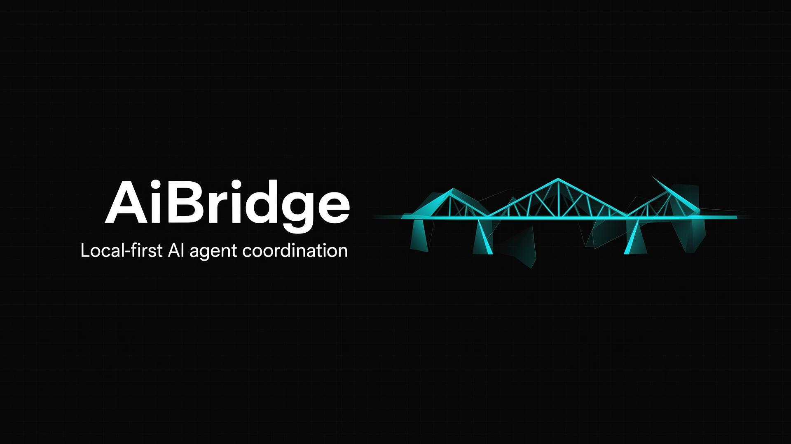
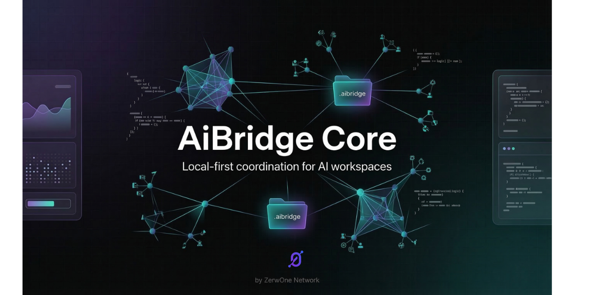

<p align="center">
  
</p>

<h1 align="center">AiBridge Core</h1>

<p align="center">
  <strong>Open-core local engine and reference standard for AI workspace coordination.</strong>
</p>

<p align="center">
  <a href="https://www.npmjs.com/package/@zerwonenetwork/aibridge-core"></a>
  <a href="LICENSE"></a>
  <a href="https://github.com/zerwonenetwork/aibridge-core"></a>
</p>

<p align="center">
  <code>npm i -g @zerwonenetwork/aibridge-core</code>
</p>

---

AiBridge Core creates a shared **`.aibridge`** directory in your repo so multiple AI coding agents can coordinate through the same **tasks, messages, handoffs, conventions, decisions, logs, context, capture state, and agent sessions**—without requiring a hosted backend.

This repository is the **local-first open-core foundation**:

| Area | What’s included |
|------|------------------|
| **Protocol** | `.aibridge` reference implementation |
| **CLI** | Full command set for setup, tasks, messages, capture, agents |
| **Service** | Local HTTP/SSE at `http://127.0.0.1:4545` |
| **Dashboard** | Local reference UI at `/dashboard` |
| **Setup** | Template-driven engine + onboarding wizard |
| **Capture** | Git hooks + file watcher |
| **Agents** | Launch, heartbeat, recovery reliability layer |

> **Note:** Hosted commercial control-plane features live in a separate product repository and are **not** included here.

---

## Table of contents

- [What AiBridge Core includes](#what-aibridge-core-includes)
- [What `.aibridge` is](#what-aibridge-is)
- [Quick Start](#quick-start)
- [CLI](#cli)
- [Dashboard](#dashboard)
- [Setup Engine](#setup-engine)
- [Capture](#capture-subsystem)
- [Agent reliability](#agent-reliability-layer)
- [Local service](#local-service)
- [Repository structure](#repository-structure)
- [Scripts](#scripts)
- [What this repo is not](#what-this-repo-is-not)
- [Publishing (maintainers)](#publishing-maintainers)
- [License](#license)

---

## What AiBridge Core includes

- **`.aibridge` protocol** — local coordination state and schema
- **CLI** — setup, tasks, messages, handoffs, decisions, conventions, logs, context, capture, agent sessions
- **Local dashboard** — at `/dashboard` (overview, tasks, activity, messages, agents, conventions, decisions, settings)
- **Local service** — at `http://127.0.0.1:4545` (HTTP + SSE)
- **Setup engine** — reusable templates and generated starter plans
- **Capture** — git hooks + file watcher for automatic activity capture
- **Agent reliability** — launch prompts, session lifecycle, heartbeats, stale detection, recovery prompts

---

## What `.aibridge` is

The **`.aibridge`** directory lives at the root of a project and is the local source of truth for AI agent coordination.

| Path | Purpose |
|------|---------|
| `bridge.json` | Bridge and setup metadata |
| `CONTEXT.md` | Auto-generated current context for agents |
| `CONVENTIONS.md` | Human-readable conventions summary |
| `agents/` | Per-agent instruction files |
| `tasks/` | Task board state |
| `messages/` | Inter-agent messages |
| `handoffs/` | Agent-to-agent handoffs |
| `decisions/` | Architectural/product decisions |
| `conventions/` | Structured conventions |
| `logs/` | Activity logs |
| `capture/` | Watcher/hook state |
| `sessions/` | Agent launch and recovery state |

---

## Quick Start

### 1. Install dependencies

```bash
npm install
```

### 2. Initialize a workspace

**Interactive:**

```bash
npm run aibridge -- init --interactive
```

**Template-driven:**

```bash
npm run aibridge -- init --template web-app --name "My Project" --description "Ship the first working slice" --stack react,typescript --multi-agent
```

**Classic direct init:**

```bash
npm run aibridge -- init --name "My Project" --agents cursor,claude,codex
```

### 3. Start the local service

```bash
npm run aibridge:service
```

### 4. Start the dashboard

In a separate terminal:

```bash
npm run dev
```

### 5. Open the local workspace

Navigate to:

```
http://localhost:8080/dashboard
```

If no bridge is found, the dashboard can launch the same setup engine used by the CLI.

---

## CLI

The CLI is the primary power-user and automation interface.

**Run locally from this repo:**

```bash
npm run aibridge -- <command>
```

**Or after installing from npm:**

```bash
npm i -g @zerwonenetwork/aibridge-core
aibridge --help
```

### Core command groups

| Group | Examples |
|-------|----------|
| **Setup** | `init`, `init --interactive`, `setup plan` |
| **Local runtime** | `status`, `context generate`, `serve` |
| **Tasks** | `task add`, `task list`, `task update`, `task done` |
| **Messages** | `message add`, `message list`, `message ack` |
| **Coordination** | `handoff create`, `decision add`, `convention set`, `log add` |
| **Capture** | `capture install-hooks`, `capture watch`, `capture status`, `capture stop` |
| **Agent reliability** | `agent launch`, `agent start`, `agent heartbeat`, `agent stop`, `agent recover`, `agent status` |

### Examples

```bash
# Preview a generated setup plan
npm run aibridge -- setup plan --template web-app --name "Acme App" --description "Ship the first customer flow" --stack react,typescript,supabase --multi-agent

# Initialize a bridge from setup
npm run aibridge -- init --template api-backend --name "Billing API" --description "Create the first billing endpoints" --stack node,postgres --multi-agent

# Add local operational state
npm run aibridge -- task add "Implement auth flow" --assign cursor --priority high
npm run aibridge -- message add "Auth module is ready for review" --from cursor --to codex
npm run aibridge -- handoff create codex "Review the auth implementation" --from cursor

# Start the local service
npm run aibridge:service

# Install capture and start the watcher
npm run aibridge -- capture install-hooks
npm run aibridge -- capture watch --agent cursor

# Launch an agent session through the reliability layer
npm run aibridge -- agent launch --agent cursor --tool cursor
```

### Notes

- **`release`** and **`announcement`** are not part of AiBridge Core CLI; they are handled by the separate commercial product.
- **`sync`** is intentionally not implemented; AiBridge Core is local-first and does not ship full cloud sync.

---

## Dashboard

AiBridge Core ships a **local dashboard** reference app.

<p align="center">
  
</p>

**Views:** Overview · Tasks · Activity · Messages · Agents · Conventions · Decisions · Settings

The dashboard uses the local service and reads local `.aibridge` state. It does **not** include a hosted `/app` control plane.

When no bridge is available, the dashboard can:

- Open sample bridge data
- Point at an existing local bridge
- Launch a lightweight setup flow using the shared setup engine

---

## Setup Engine

A shared setup engine is used by the **CLI**, **local dashboard onboarding**, and **local service** setup endpoints.

**Templates:** `web-app` · `api-backend` · `mobile-app` · `landing-page` · `ai-automation` · `research-docs` · `empty`

**Generated:** project brief, starter roles/tasks/conventions, definition of done, kickoff coordination, initial bridge state.

```bash
npm run aibridge -- setup plan --template landing-page --name "Marketing Site" --description "Ship a strong narrative landing page"
```

---

## Capture subsystem

Automatic capture of local development activity:

- **Git hooks** — commit/merge/checkout
- **File watcher** — local edit activity
- **capture doctor/status** — diagnostics
- **Validation logging** — malformed capture events

```bash
npm run aibridge -- capture install-hooks
npm run aibridge -- capture doctor
npm run aibridge -- capture watch --agent cursor
```

---

## Agent reliability layer

Launch-handshake model so you don’t have to manually message agents to start or recover them.

**Features:** tool-specific launch prompts · pending → active → stale → stopped lifecycle · heartbeats · stale detection · recovery prompts

```bash
npm run aibridge -- agent launch --agent codex --tool codex
npm run aibridge -- agent start --session <session-id>
npm run aibridge -- agent status
npm run aibridge -- agent recover --session <session-id>
```

---

## Local service

The local service exposes bridge state over **HTTP** and **SSE**.

```bash
npm run aibridge:service
```

**Endpoints:** `GET /health` · `GET /bridge/status` · `GET /bridge/events` · `GET /bridge/setup/templates` · `POST /bridge/setup/plan` · `POST /bridge/setup/init` · entity endpoints for tasks, messages, handoffs, decisions, conventions, logs, agent sessions.

---

## Repository structure

```
aibridge-core/
├── aibridge/     # runtime, CLI, service, capture, setup
├── src/           # dashboard app and frontend client code
├── public/        # static assets (incl. og-image, examples)
├── examples/      # reference workflows
├── scripts/       # build helpers
└── package.json
```

---

## Scripts

| Script | Description |
|--------|-------------|
| `npm run dev` | Local dashboard dev server |
| `npm run aibridge:service` | Local bridge service |
| `npm run build` | Build web app + CLI bundle |
| `npm run test` | Run tests |
| `npm run lint` | ESLint |
| `npm run typecheck` | TypeScript check |
| `npm run aibridge -- <cmd>` | Run CLI from source |
| `npm run aibridge:bin -- --help` | Run built CLI bundle |

---

## What this repo is not

AiBridge Core is **not** a hosted control plane, team dashboard product, cloud sync service, or hosted release/announcement center. Those belong to the separate commercial product built on this foundation.


---

## License

**MIT**
